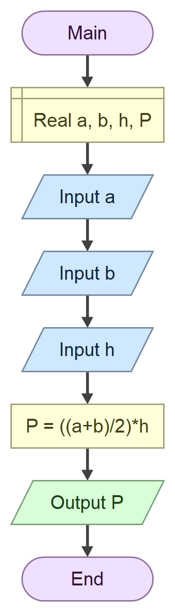

# Домаћи задатак из Техничке документације
##  Задатак
Програм који на основу унетих дужина **страница** трапеза a и b и висине h израчунава
**површину** трапеза P.

$P = \frac{a+b}{2} \cdot h$
### Алгоритамска шема

## Решење
```cs
using System;

class Program
{
    static void Main()
    {
        double a;
        double b;
        double h;
        double P;

        Console.Write("Unesite dužinu stranice a: ");
        a = double.Parse(Console.ReadLine());

        Console.Write("Unesite dužinu stranice b: ");
        b = double.Parse(Console.ReadLine());

        Console.Write("Unesite visinu h: ");
        h = double.Parse(Console.ReadLine());

        P = ((a + b) / 2) * h;

        Console.WriteLine("Površina trapeza je: " + P);
    }
}
```
### Тест примери
Тест пример 1
```text
Unesite duzinu stranice a: 8
Unesite duzinu stranice b: 3
Unesite visinu h: 10
Povrsina trapeza je: 55

C:\Users\Aleksa Caran\source\repos\ConsoleApp1\bin\Debug\ConsoleApp1.exe (process 14672) exited with code 0 (0x0).
Press any key to close this window . . .
```
Тест пример 2
```text
Unesite duzinu stranice a: 40
Unesite duzinu stranice b: 33
Unesite visinu h: 10
Povrsina trapeza je: 365

C:\Users\Aleksa Caran\source\repos\ConsoleApp1\bin\Debug\ConsoleApp1.exe (process 4884) exited with code 0 (0x0).
Press any key to close this window . . .
```
### Објекти
|Редни број|Променљива|Тип променљиве|
|----------|----------|--------------|
|1.|a|double|
|2.|b|double|
|3.|h|double|
|4.|P|double|


